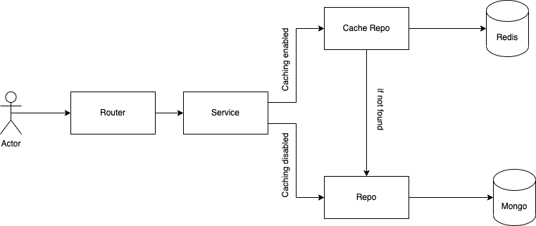

Platform-Go-Challenge (GWI THA)
==

# Overview

<b>Platform-Go-Challenge</b> is the microservice that owns the information about user favourite assets.

# Quick Start

Just execute `make serve` to serve the program via docker.

# Features

- List user favourite assets.
- Add an asset to favourites.
- Update a favourite asset's description.
- Delete an asset from favourites.

# Glossary

| Term     | Description                                                                                                                                            |
|----------|--------------------------------------------------------------------------------------------------------------------------------------------------------|
| Asset    | an Asset is an entity that can be one of the following (Chart, Insight, Audience)                                                                      |
| Chart    | Chart entity type                                                                                                                                      |
| Insight  | A small piece of text that provides some insight into a topic, e.g. "40% of millenials spend more than 3hours on social media daily"                   |
| Audience | Ιs a series of characteristics Eg. gender (Male, Female), birth country, age groups, hours spent daily on social media, number of purchases last month |

## Tech Stack

| Type      | Item  | Version |
|-----------|-------|---------|
| Language  | Go    | 1.18    |
| Framework | Echo  | v4      |

## Infrastructure Services

| Type             | Provider | Version    | Purpose            |
|------------------|----------|------------|--------------------|
| Document Storage | Mongo    | 4.4.18-rc0 | Persistent Storage |
| K/V store        | Redis    | 6.2-alpine | Handles Caching    |

# API

## HTTP

Postman Collection Location: _under doc/postman/_

# Developers Handbook

## Build and Run

Please use `make <target>` where `<target>` is one of the following:

```
`serve`                          Serve the app with Docker Compose
`ci`                             Run the CI pipeline
`lint`                           Perform linting
`stop`                           Stop the Docker Compose app
`test`                           Run the unit tests
```

# Technical Details

For guaranteed data consistency it is recommended disabling cache.

## Technical Overview



## What has been implemented

- [x] Unit testing.
- [ ] Integration testing.
- [ ] E2E testing.
- [ ] Benchmark testing.
- [x] Caching layer using decorator pattern.
- [x] Adapter pattern for handling the dynamic data types.
- [ ] Use builder pattern for creating objects.
- [ ] Add metrics.
- [x] Docker implementation.
- [x] Postman collection.

## Future Improvements

- In the current implementation Assets & Favourite assets are coupled into the same db. In order to decouple these, a
  new
  service should be created that aggregates assets & favourite assets along with users using the BFF pattern.
- Repository favourite assets adapter should be thinner & and should separate the logic of transforming asset data types
  into the service level.
- Better configuration management system with multiple type conversions.
- Add validators for validating user input.
- User authentication for avoiding passing user_id to url, should get the user id from user session.
- Avoid creating duplicate user favourite assets.
- Avoid exposing real ids.
- Improve testing code coverage (especially in main & Mongo)
- Add pagination.
